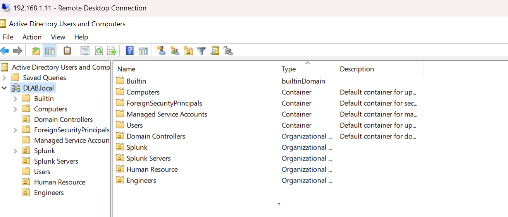

# Organizational Unit Structure

## Overview

Organizational Units (OUs) are used to logically separate users, computers and resources.

The OU design allows targeted Group Policy application and improved administrative management.

---

# Current OU Structure

The current domain contains the following organizational units:

dlab.local

├── HR
├── Engineers
├── Splunk
└── Splunk Server

---

# Evidence

The following screenshot shows the OU structure in Active Directory Users and Computers.

---

# Future Enterprise Improvements

Planned improvements:
- Easier GPO targeting
- Better privilege separation
- Improved security management
