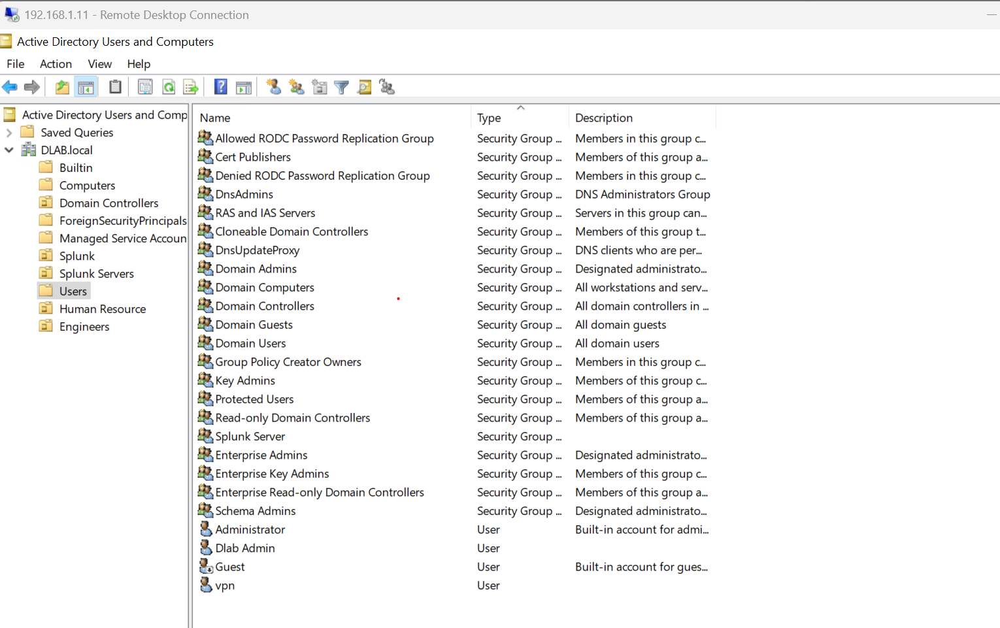
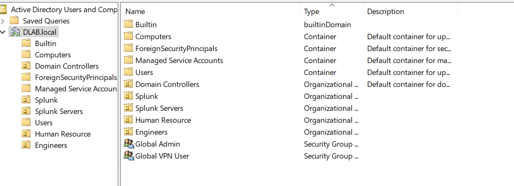

# Active Directory Users and Groups

## Overview

This document describes user account management and security group organisation within the `dlab.local` Active Directory environment.

Active Directory users and groups provide centralised identity management and role-based access control.

---

# User Accounts

The current environment contains the following user accounts:

| User | Purpose |
|---|---|
| Pratima | User Account |
| Pratibha | User Account |
| Shubham | User Account |
| Gopal Prasad | User Account |
| Diwaker Prasad | Administrator / User Account |
| Dev | User Account |

---

# Security Groups

The environment currently contains the following custom security groups:

| Group Name | Type | Purpose |
|---|---|---|
| Global Admin | Global Security Group | Administrative access management |
| Global VPN | Global Security Group | Remote VPN access management |

---

# Group-Based Access Control

Access is managed using security groups rather than assigning permissions directly to individual users.

Example:

```
User
 |
 |
Member Of
 |
 |
Security Group
 |
 |
Resource Permission
```

Benefits:

- Easier administration
- Reduced permission errors
- Supports least privilege model
- Simplifies onboarding/offboarding

---

# Evidence

## User Accounts




## Security Groups




---

# Future Enterprise Improvements

The following improvements are planned:

## Administrative Separation

Create dedicated administrative accounts:

Example:

```
DLAB-DP-ADMIN
```

instead of using personal accounts for privileged activities.

---

## Additional Security Groups

Planned groups:

```
GG-HR

GG-ENGINEERS

GG-IT-ADMINS

GG-SERVER-ADMINS

GG-FILE-ACCESS

GG-VPN-USERS
```

---

## Service Accounts

Dedicated service accounts will be created for:

```
Splunk Service

NetLock RMM Service

Automation Service
```

with:

- Minimum required permissions
- Password rotation
- Monitoring
