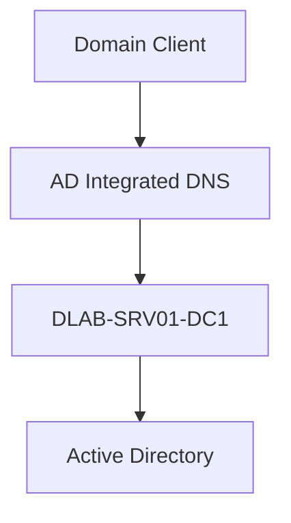
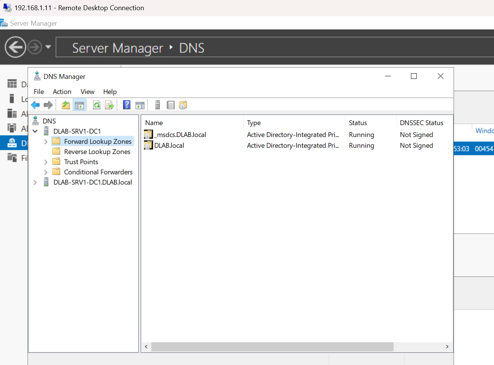
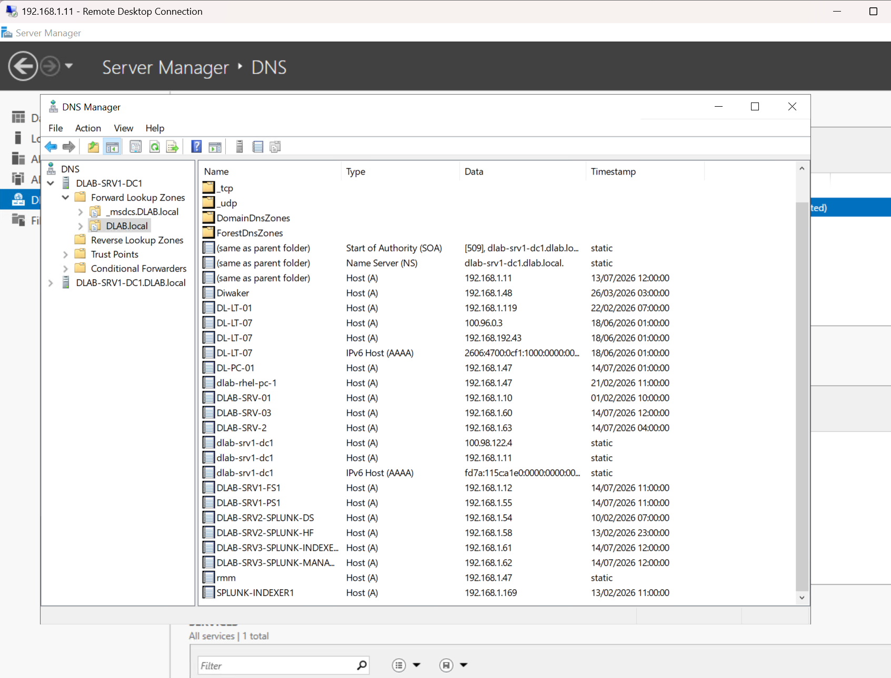

# Active Directory DNS Design

## Overview

DNS is a core component of the Active Directory infrastructure.

The `dlab.local` domain uses Active Directory Integrated DNS to provide name resolution for domain controllers, servers and client devices.

---

# DNS Environment

| Component | Details |
|---|---|
| Domain | dlab.local |
| DNS Server | DLAB-SRV01-DC1 |
| DNS Type | Active Directory Integrated |
| DHCP Provider | UniFi Dream Machine |
| Primary Network | 192.168.1.0/24 |

---

# DNS Architecture



---

# DNS Zones

The environment contains:

## Forward Lookup Zone

Purpose:

- Resolves hostname to IP address
- Allows clients to locate servers
- Supports Active Directory services


Example:

```
DLAB-SRV01-DC1
        |
        |
192.168.1.11
```

---

# DNS Records

Common records include:

| Record Type | Purpose |
|---|---|
| A Record | Hostname to IP mapping |
| SRV Record | Active Directory service discovery |
| CNAME | Alias records |

---

# Evidence

## Forward Lookup Zone




## Host Records




---

# DNS Validation

DNS functionality can be tested using:

```
nslookup dlab.local
```

and:

```
nslookup DLAB-SRV01-DC1
```

---

# Security Considerations

Implemented:

- Internal DNS only
- Domain integrated DNS
- No external exposure
- Controlled administrative access

Future improvements:

- DNS logging to SIEM
- DNS query monitoring
- Suspicious domain detection
- Integration with Microsoft Sentinel
