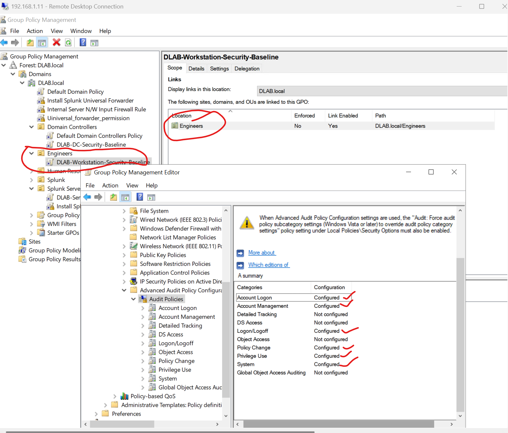
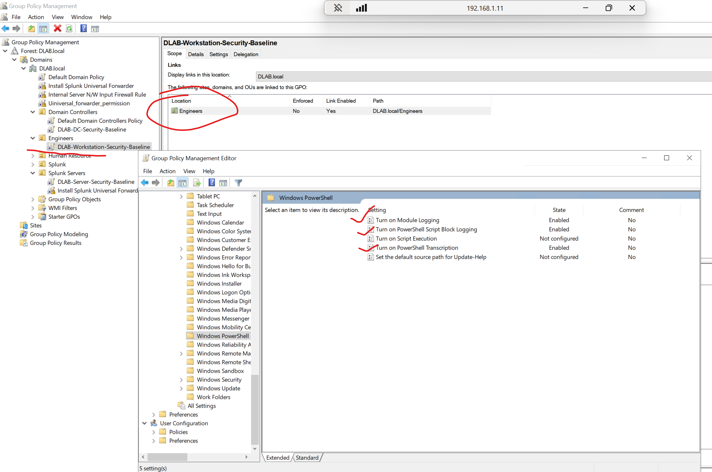
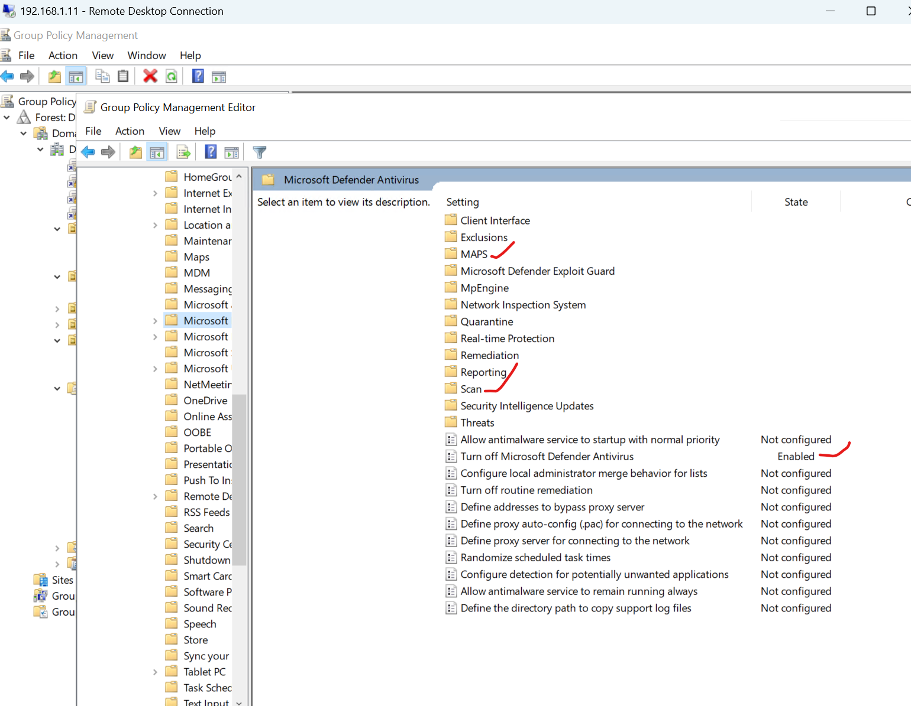
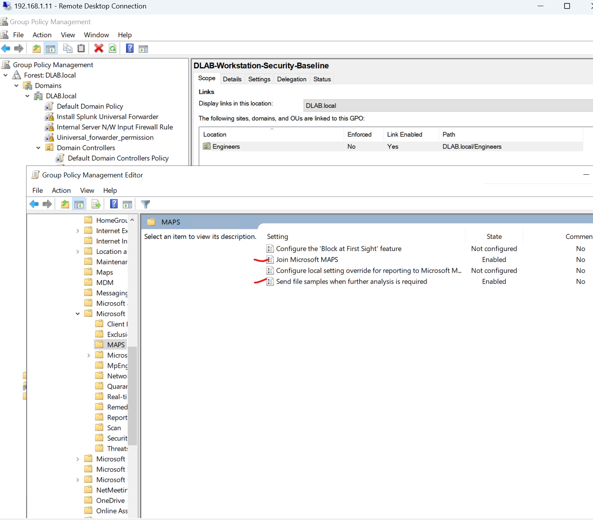

## Advanced Audit Policy

The workstation security baseline enables Advanced Audit Policies to improve security visibility and support SIEM integration.

### Configured Audit Categories

| Category | Configuration |
|----------|---------------|
| Account Logon | Success, Failure |
| Logon/Logoff | Success, Failure |
| Account Management | Success, Failure |
| Policy Change | Success |
| Privilege Use | Success, Failure |
| System | Success, Failure |

### Evidence

### Security Benefit

These audit settings generate Windows Security Events that are collected by Splunk Universal Forwarder and will later be ingested into Microsoft Sentinel. They provide visibility into authentication activity, account management, privilege escalation attempts and system integrity changes.

## PowerShell Logging

PowerShell logging has been enabled to improve visibility into script execution and administrative activity.

### Configured Features

| Feature | Status |
|---------|--------|
| Script Block Logging | Enabled |
| Module Logging | Enabled |
| PowerShell Transcription | Enabled |

### Evidence

### Security Benefit

These settings provide detailed telemetry for PowerShell activity. The resulting events are valuable for detecting malicious scripts, encoded commands, and post-exploitation techniques, and are intended for collection by Splunk and Microsoft Sentinel.

## Microsoft Defender Security Baseline

The workstation security baseline includes Microsoft Defender Antivirus policies to improve endpoint protection.

### Configured Policies

| Policy | Configuration |
|---------|---------------|
| Microsoft Defender Antivirus | Enabled |
| Real-time Protection | Enabled |
| Behavior Monitoring | Enabled |
| Scan Downloads | Enabled |
| MAPS Reporting | Advanced |
| Automatic Sample Submission | Safe Samples |

### Evidence

### Security Benefit

These settings improve malware detection, behavioral monitoring and cloud-assisted threat protection. Alerts and related Windows Defender events can later be collected by Splunk and Microsoft Sentinel for investigation and correlation.
