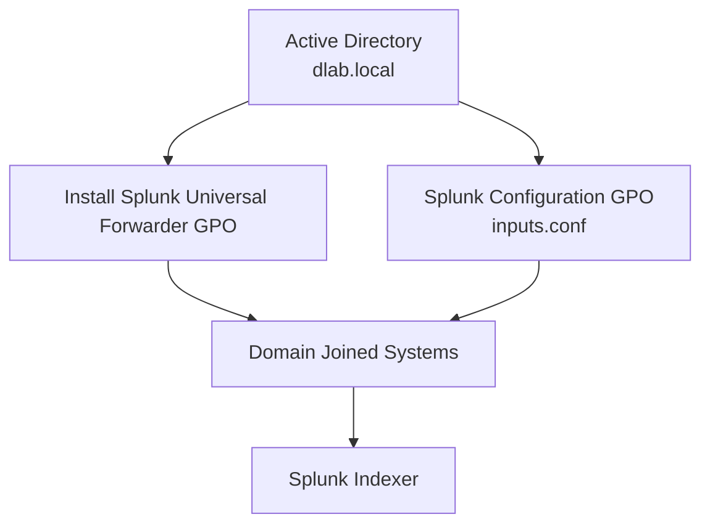

# Splunk Integration Through Group Policy

## Overview

The GPCTech Enterprise Lab uses Active Directory Group Policy Objects (GPOs) to automate Splunk Universal Forwarder deployment and configuration.

This simulates enterprise endpoint logging deployment where security agents are centrally managed.

---

# Architecture



---

# Current GPOs

| GPO | Purpose |
|---|---|
| Install Splunk Universal Forwarder | Automated deployment |
| Universal Forwarder Configuration | Deploy inputs.conf configuration |

---

# Deployment Process

```
Domain Computer Starts

        |
        |
Group Policy Refresh

        |
        |
Splunk Universal Forwarder Installed

        |
        |
Configuration Files Applied

        |
        |
Windows Events Forwarded To Splunk
```

---

# Benefits

- Centralised agent deployment
- Consistent endpoint configuration
- Reduced manual installation
- Scalable security monitoring

---

# Future Improvements

Planned:

- Certificate-based Splunk communication
- Deployment of outputs.conf
- Forwarder monitoring
- Sentinel integration
- Automated health checks
