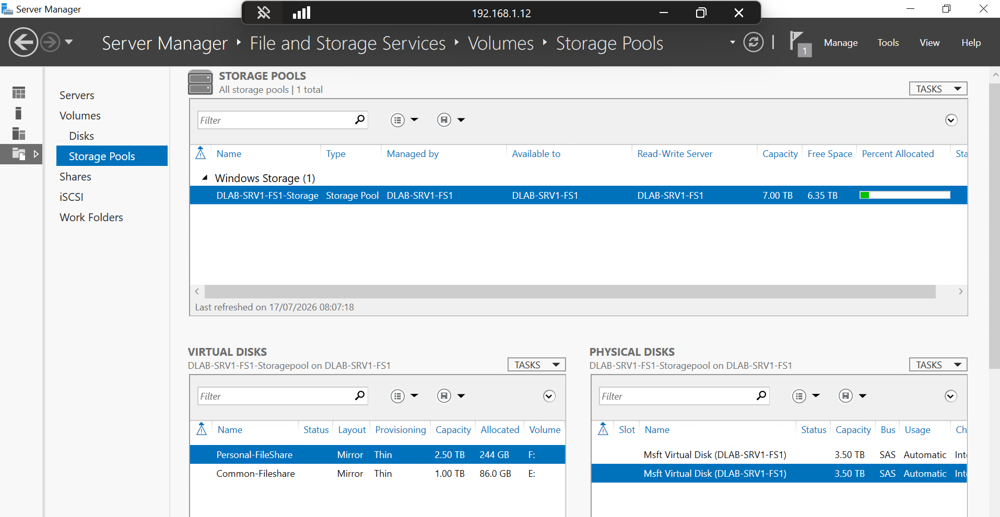
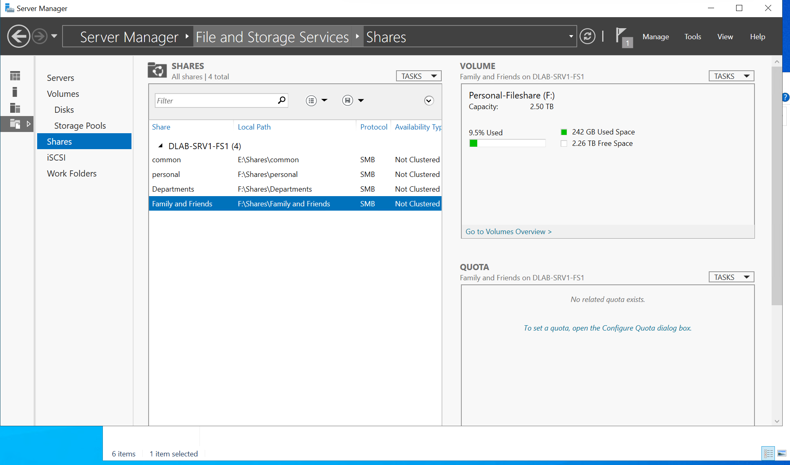

# File Server Overview

## Purpose

The GPCTech Enterprise Lab includes a dedicated Windows Server 2022 File Server (`DLAB-SRV01-FS1`) providing centralized storage for departmental data across the Active Directory environment.

The server demonstrates enterprise-grade file sharing, access control, auditing, and backup practices commonly implemented within medium and large organisations.

---

## Server Information

| Property | Value |
|----------|-------|
| Server Name | DLAB-SRV01-FS1 |
| Role | File Server |
| Operating System | Windows Server 2022 Standard Evaluation |
| Domain | dlab.local |
| Authentication | Active Directory |
| File Sharing Protocol | SMB |

---

## Objectives

- Centralized departmental storage
- Secure file sharing
- Role-Based Access Control (RBAC)
- Least Privilege security model
- File access auditing
- SIEM integration with Splunk Enterprise
- Future Microsoft Sentinel integration

---

## Enterprise Features

- Windows File Services
- SMB Shares
- NTFS Permissions
- Active Directory Security Groups
- Access-Based Enumeration
- Object Access Auditing
- Windows Storage Spaces
- Backup and Recovery
- Centralized authentication

---

## Evidence

### Server Manager

### Storage Configuration

