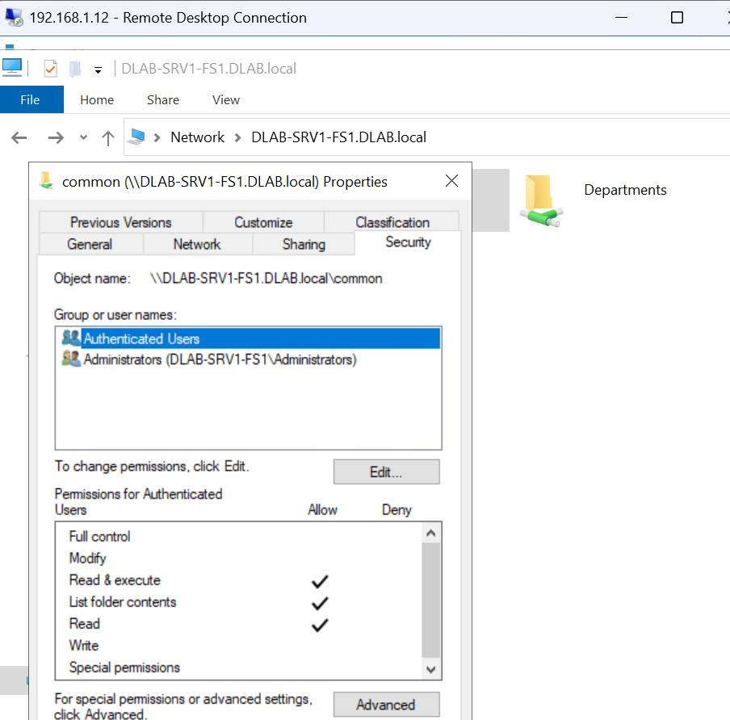
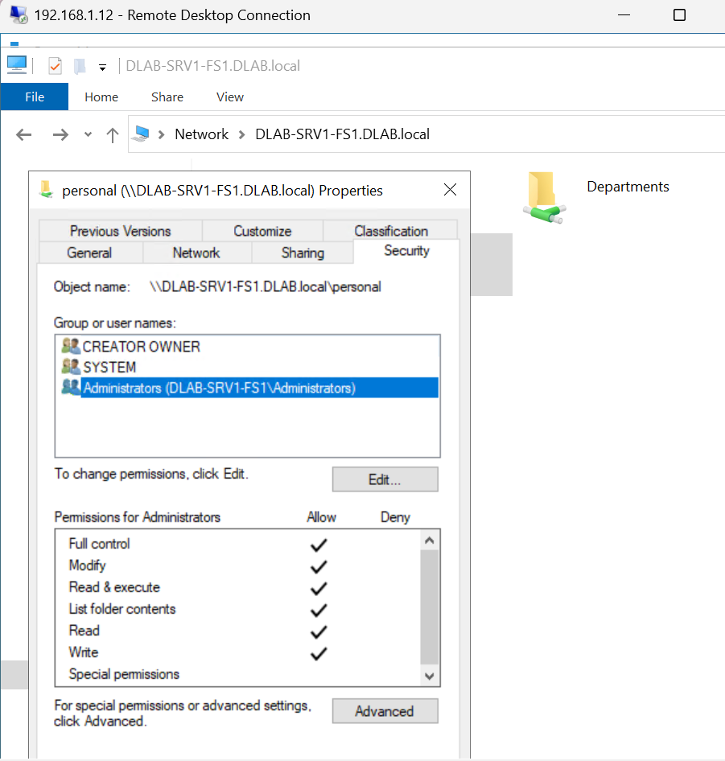

# 03-NTFS-Permissions.md

```markdown
# NTFS Permissions

## Purpose

NTFS permissions provide granular access control to files and folders within the enterprise file server.

The environment follows Microsoft's recommended Role-Based Access Control (RBAC) model by assigning permissions through Active Directory security groups rather than individual user accounts.

---

## Permission Strategy

Users

↓

Global Groups

↓

Domain Local Groups

↓

NTFS Permissions

↓

Shared Folder

---

## Security Principles

- Least Privilege
- Role-Based Access Control
- Centralized Permission Management
- Simplified Administration
- Auditable Access

---

## Planned Security Groups

| Group | Department |
|--------|------------|
| GG-HR | Human Resources |
| GG-ENGINEERING | Engineering |
| GG-IT | IT |
| GG-PROJECTS | Projects |
| GG-SOFTWARE | Software |
| GG-BACKUP | Backup Operators |
| GG-PERSONAL | Personal Storage |

---

## Benefits

- Easier administration
- Reduced permission complexity
- Better auditing
- Enterprise scalability

---

## Evidence




