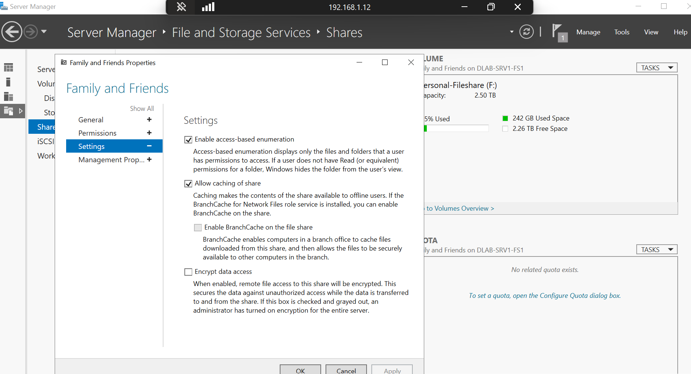
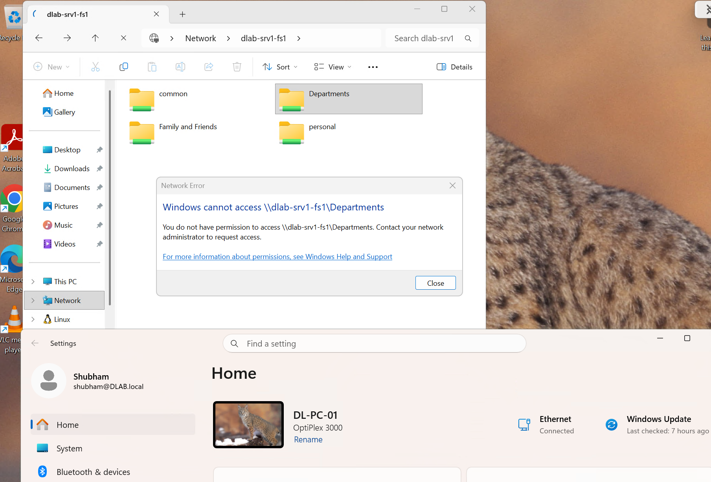

# Access-Based Enumeration (ABE)

## Overview

Access-Based Enumeration (ABE) has been implemented on the enterprise file server to ensure users only see folders and files for which they have been granted access permissions.

ABE reduces unnecessary information disclosure by hiding inaccessible shares and directories from users, improving both security and usability.

---

## Implementation

Access-Based Enumeration has been enabled on all departmental SMB shares hosted on `DLAB-SRV01-FS1`.

The configuration works alongside Active Directory security groups and NTFS permissions to enforce role-based access control.

---

## Benefits

- Prevents users from discovering unauthorized departmental folders
- Reduces information disclosure
- Simplifies navigation by displaying only accessible resources
- Supports enterprise least-privilege security practices

---

## Validation

The implementation was verified by testing user accounts with different Active Directory group memberships.

Expected behaviour:

- Authorized users can view and access permitted shares.
- Unauthorized departmental folders remain hidden.
- Access attempts to restricted folders are denied and logged for auditing.

---

## Enterprise Architecture

```text
Active Directory Security Groups
            │
            ▼
      NTFS Permissions
            │
            ▼
Access-Based Enumeration
            │
            ▼
 Visible Shares for User
```

---

## Evidence




